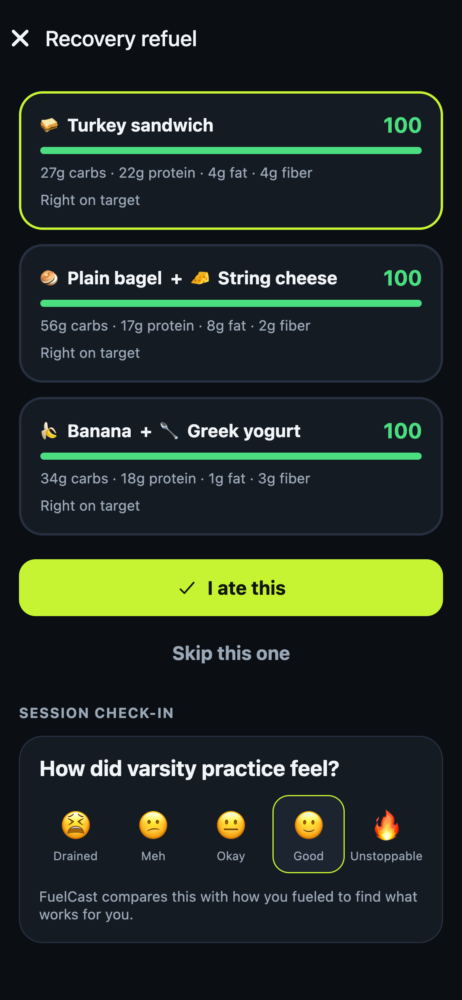
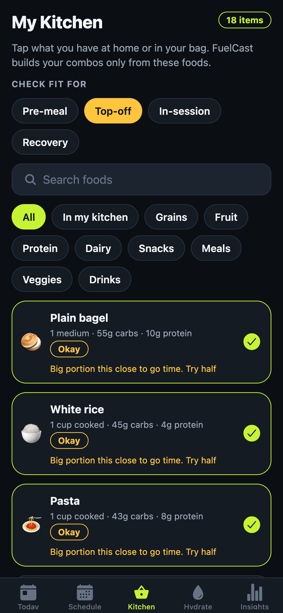
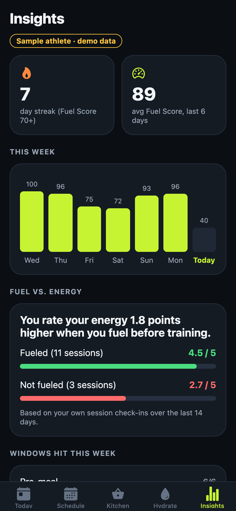
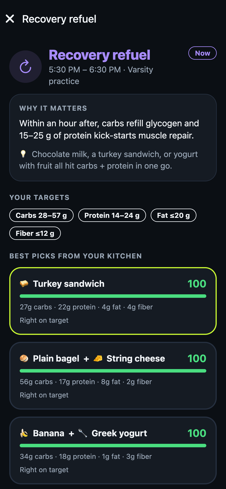
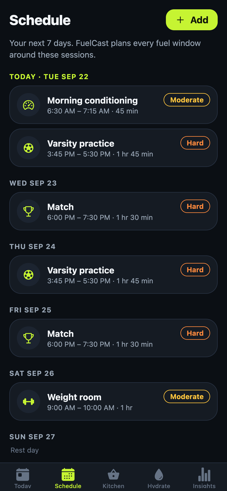
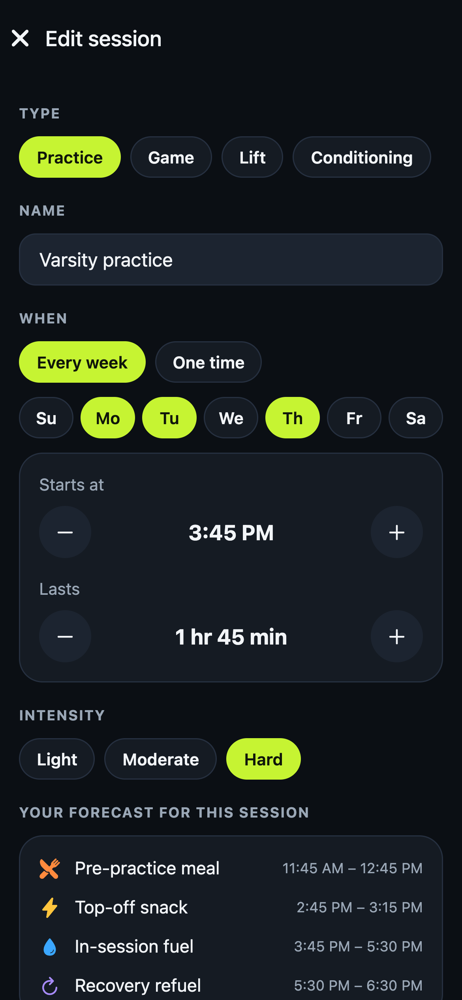
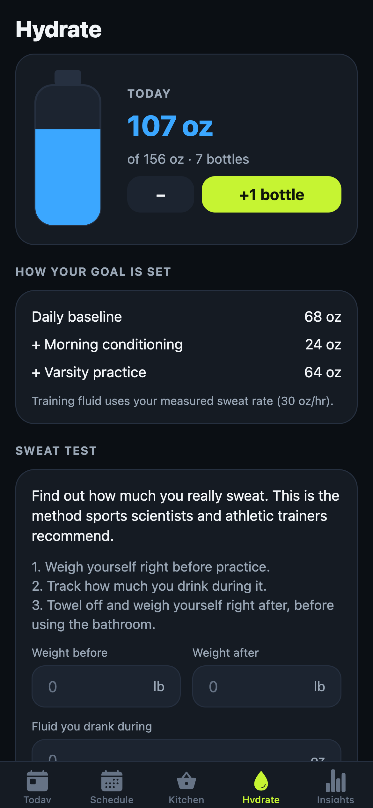
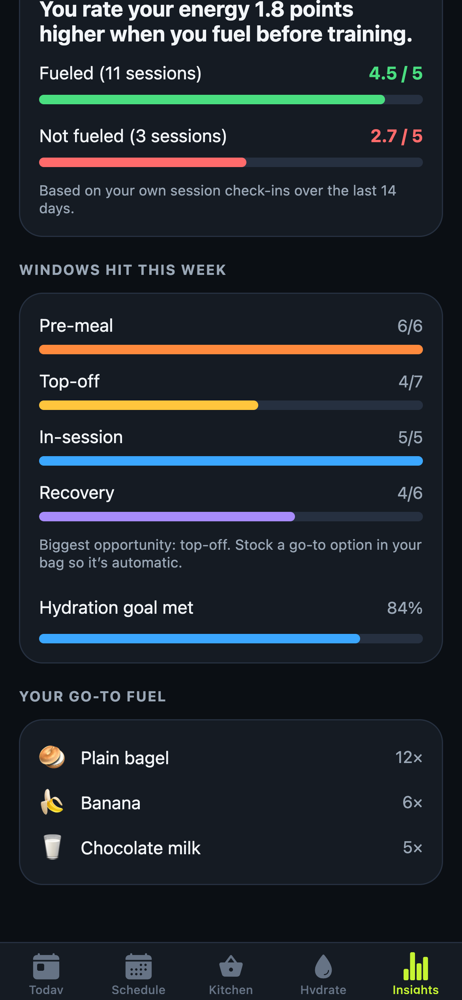
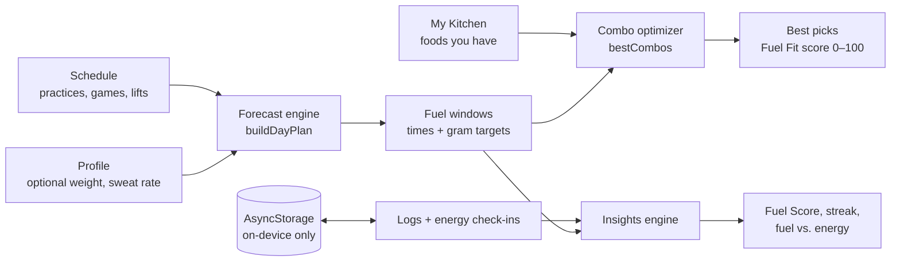

# ⚡ FuelCast

**Your fuel forecast for game day.**

FuelCast is an iPhone app for high-school athletes. It turns your practice and game schedule into a timeline of *when* to eat and drink, and *what* to grab from the food you already have. After each session, you rate how you felt, and FuelCast shows how your fueling habits change your energy.

> Built for the **2026 Georgia TSA / CTSO Rally: App Development Pitch** · Theme: **Fitness & Nutrition**

<p align="center">
  
  
  
  
</p>

---

## The problem

More than 8 million U.S. students play high-school sports. Most of them never get sports-nutrition coaching; sports dietitians are common in college and pro sports but rare in high schools. Teen athletes get told to "eat healthy," but nobody tells them the part that matters on game day: **timing**. They skip lunch, then show up to a 3:45 practice running on empty. They grab chips from the vending machine 20 minutes before warm-ups. They forget to refuel after practice, and they arrive already dehydrated.

Most nutrition apps don't help: they're built around **calorie counting and weight goals**, which is the wrong tool for a 15-year-old and can feed disordered eating.

## The solution

FuelCast answers three questions an athlete actually has:

| Question | FuelCast feature |
|---|---|
| *When should I eat?* | **Fuel Forecast**: a timeline built from your schedule, with a pre-session meal (3–4 h before), a top-off snack (30–60 min), in-session fuel for long or hard sessions, and a recovery window (within 1 h after) |
| *What should I eat, from what I actually have?* | **My Kitchen + Fuel Fit**: tap the foods you have. FuelCast searches every combination and ranks the best plates for that exact window |
| *How much should I drink?* | **Hydrate**: a daily goal that grows with your training, plus a real **sweat test** that personalizes your fluid plan |
| *Does it matter?* | **Insights**: a 1-tap energy check-in after each session, compared against whether you fueled. Your own data shows the difference |

**Design principles:** no calorie counting, no weight goals, no accounts, and all data stays on the phone. Body weight is optional and only used for fluid math.

## Screens

| | | | |
|---|---|---|---|
|  |  |  |  |
| **Onboarding** | **Today / Fuel Forecast** | **Fuel window: the why + targets** | **Best picks + check-in** |
|  |  |  |  |
| **Schedule** | **Session editor with live preview** | **My Kitchen + Fuel Fit** | **Hydrate + sweat test** |
|  |  | | |
| **Insights** | **Windows hit, go-to fuel** | | |

## Run it on your iPhone (5 minutes)

FuelCast is built with **Expo (React Native)**, so it runs on a real iPhone through the free **Expo Go** app. You don't need Xcode or an Apple developer account.

1. On the iPhone, install **Expo Go** from the App Store.
2. On the Mac (Node.js 20+ installed):
   ```bash
   cd fuelcast
   npm install
   npx expo start
   ```
3. Scan the QR code in the terminal with the iPhone **Camera** app. It opens in Expo Go.
   - The phone and Mac must be on the same Wi-Fi. On school Wi-Fi that blocks this, use `npx expo start --tunnel`.
4. Tap **Explore with a sample athlete** to load two weeks of demo data, or **Get started** to set up your own.

You can also run it in a browser with `npx expo start --web`. The layout is phone-sized.

## How it works (short version)



- **Forecast engine** ([`src/engine/forecast.ts`](src/engine/forecast.ts)) turns each session into timed windows, handles early-morning sessions, and merges collisions on two-a-day schedules (e.g. "Recover + reload").
- **Fuel Fit** ([`src/engine/fuelFit.ts`](src/engine/fuelFit.ts)) rates each food for each window (digestion speed, fat, fiber, protein), then enumerates every 1–3 item combination from your kitchen and scores it against the window's gram targets.
- **Hydration** ([`src/engine/hydration.ts`](src/engine/hydration.ts)) runs the sweat-rate formula used by sports scientists and builds an itemized daily goal.
- **Insights** ([`src/engine/insights.ts`](src/engine/insights.ts)) computes the daily Fuel Score, streaks, and the fueled-vs-unfueled energy comparison.

The full write-up is in **[docs/ARCHITECTURE.md](docs/ARCHITECTURE.md)**, and the science and sources are in **[docs/RESEARCH.md](docs/RESEARCH.md)**.

## Tech stack

| Layer | Choice | Why |
|---|---|---|
| App framework | **Expo SDK 57 / React Native 0.86** | One TypeScript codebase that runs natively on iPhone; test on a real device with Expo Go |
| Language | **TypeScript (strict)** | Catches bugs at compile time |
| Navigation | **Expo Router** (file-based) | Every screen is a file in `app/` |
| Storage | **AsyncStorage** | On-device key-value storage, with no server or account needed |
| Graphics | **react-native-svg** | Fuel Score ring, water bottle, charts |
| Testing | **Jest** (`jest-expo`) | 35 unit tests on the engine |
| CI | **GitHub Actions** | Type-check and tests on every push |

## Project structure

```
fuelcast/
├── app/                    # Screens (Expo Router: file = route)
│   ├── _layout.tsx         # Root stack, theme, data provider
│   ├── onboarding.tsx      # Welcome → name/sport → units/bottle/weight
│   ├── (tabs)/             # Bottom tabs
│   │   ├── index.tsx       # Today: Fuel Score + Fuel Forecast timeline
│   │   ├── schedule.tsx    # Next 7 days of sessions
│   │   ├── kitchen.tsx     # My Kitchen + Fuel Fit ratings
│   │   ├── hydrate.tsx     # Water tracker + sweat test
│   │   └── insights.tsx    # Streak, weekly scores, fuel vs. energy
│   ├── window/[id].tsx     # A fuel window: why, targets, best combos, log
│   ├── event.tsx           # Add / edit a session
│   └── settings.tsx        # Profile, demo data, reset, sources
├── src/
│   ├── engine/             # Pure TypeScript logic (no UI), fully unit-tested
│   ├── data/               # Food library (USDA-based), demo athlete
│   ├── state/              # App store (React context + AsyncStorage)
│   └── ui/                 # Theme + shared components
├── __tests__/              # Jest tests for the engine
└── docs/                   # Architecture, research, design, video script
```

## Scripts

| Command | What it does |
|---|---|
| `npm start` | Start the Expo dev server (scan the QR with your iPhone) |
| `npm run web` | Run in a browser |
| `npm test` | Run the unit tests |
| `npm run typecheck` | TypeScript type-check |
| `npm run check` | Type-check + tests (what CI runs) |

## Documentation

- [docs/ARCHITECTURE.md](docs/ARCHITECTURE.md): technical design, data flow, algorithms
- [docs/RESEARCH.md](docs/RESEARCH.md): the problem, the target audience, and the science with citations
- [docs/DESIGN.md](docs/DESIGN.md): UI/UX decisions, screen flow, accessibility, ethics
- [docs/VIDEO_SCRIPT.md](docs/VIDEO_SCRIPT.md): the 3-minute pitch video script and shot list
- [docs/SUBMISSION_CHECKLIST.md](docs/SUBMISSION_CHECKLIST.md): competition requirements mapped to the video
- [CHANGELOG.md](CHANGELOG.md) · [CONTRIBUTING.md](CONTRIBUTING.md) · [LICENSE](LICENSE)

## Disclaimer

FuelCast is an educational tool, not medical advice. Athletes with medical conditions, food allergies, or specific dietary needs should talk with their athletic trainer, doctor, or a registered dietitian. Macro values are rounded approximations based on USDA FoodData Central.

## License

[MIT](LICENSE)
