# ⚡ FuelCast

**Train smart. Fuel smart. One app for teen athletes.**

FuelCast is an iPhone app for high-school athletes that combines the three things they juggle alone:

- **When and what to eat:** a *fuel forecast* built from your practice and game schedule
- **How to train:** a gym planner with 20 starter workouts, custom workouts, live set logging, and a **Smart Coach** that recommends the right workout for today
- **What to cook and buy:** recipes from the food you already have, and a shopping list built from your week

An optional **AI Coach powered by Claude** ties it together: ask anything, and it answers with your schedule, muscle readiness and kitchen in mind. It can hand you a workout you save with one tap, a recipe, or shopping items.

> Built for the **2026 Georgia TSA / CTSO Rally: App Development Pitch** · Theme: **Fitness & Nutrition**

<p align="center">
  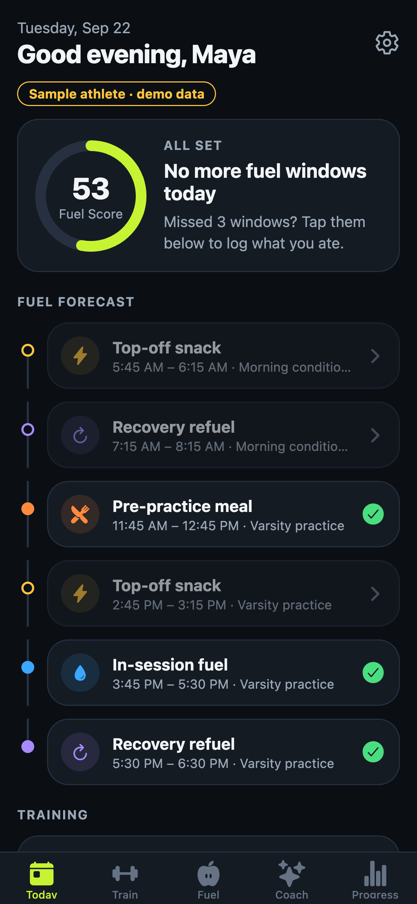
  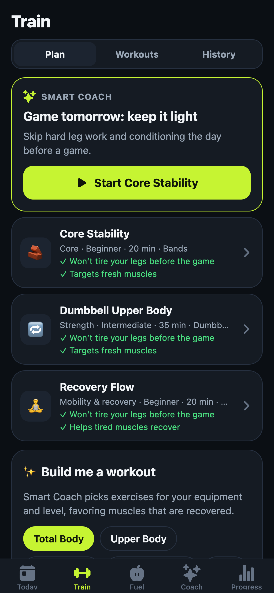
  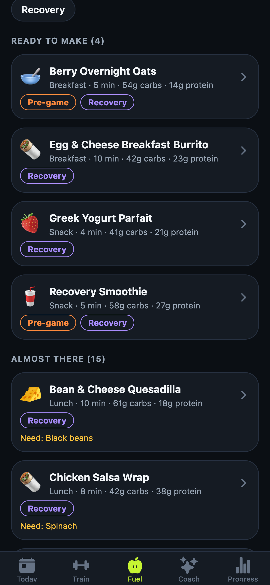
  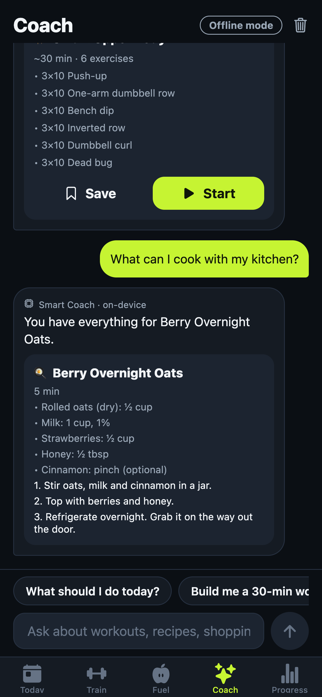
</p>

---

## The problem

More than 8 million U.S. students play high-school sports. Almost none have a sports dietitian or a personal strength coach, so they guess:

- They skip lunch before a 3:45 practice, or eat chips 20 minutes before warm-ups.
- They copy workouts from social media that ignore their schedule. Heavy leg day the night before a game is a classic mistake.
- They don't know what to make with what's in the fridge, so they grab whatever's fast.
- The apps they find count calories and push weight goals, which is the wrong tool for teenagers.

## The solution

| Need | FuelCast feature |
|---|---|
| *When should I eat?* | **Fuel Forecast:** pre-game meal (3–4 h before), top-off snack (30–60 min), in-session fuel, and recovery (within 1 h), timed around every session |
| *What should I eat right now?* | **Fuel Fit:** the best 1–3 item combos from *your* kitchen, scored 0–100 against sports-nutrition targets |
| *What should I train today?* | **Smart Coach:** tracks muscle readiness from your lifts *and* practices, knows when games are, and ranks workouts with reasons ("Game tomorrow: keep it light") |
| *How do I run a workout?* | **Gym planner:** 56 exercises, 20 starter workouts, a custom builder, a one-tap generator, and a live logger with rest timer and automatic weight progression |
| *What can I cook?* | **Recipes:** 20 teen-friendly recipes matched to your kitchen (ready / almost / shop), each tagged by which fuel window it fits |
| *What do I buy?* | **Shopping list:** built from this week's schedule plus missing recipe ingredients; bought items move into your kitchen |
| *Can I just ask someone?* | **AI Coach (Claude):** chat that knows your context and returns structured workouts, recipes and shopping items. It also works **offline** with on-device answers |
| *Is it working?* | **Progress:** Fuel Score, streaks, fuel-vs-energy insight, strength days vs. youth guidelines, muscle readiness |

**Teen-safe by design:** no calorie counting, no weight goals, youth resistance-training guidelines built in, no supplements or energy drinks, and a coach that refers injuries to athletic trainers. All data stays on the phone.

## Screens

| | | | |
|---|---|---|---|
| 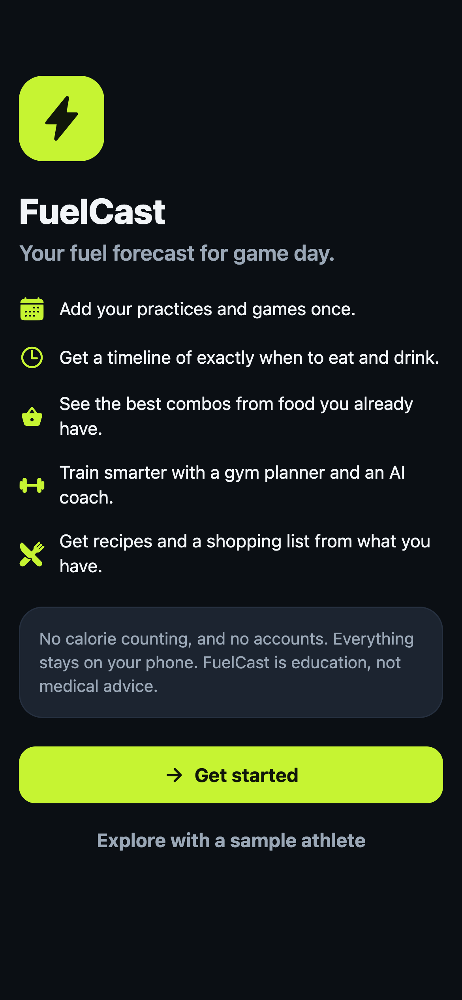 |  | 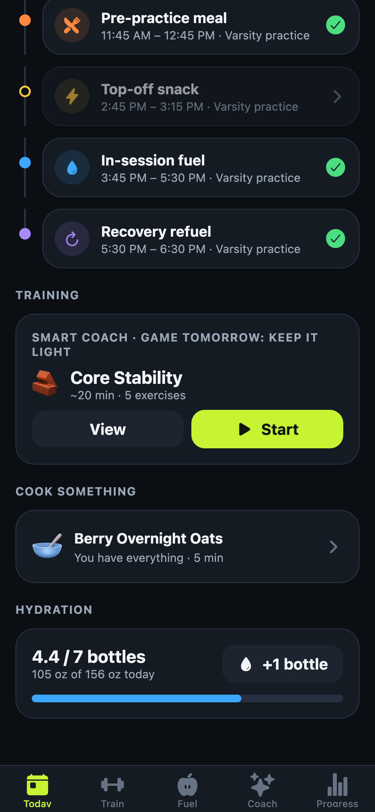 | 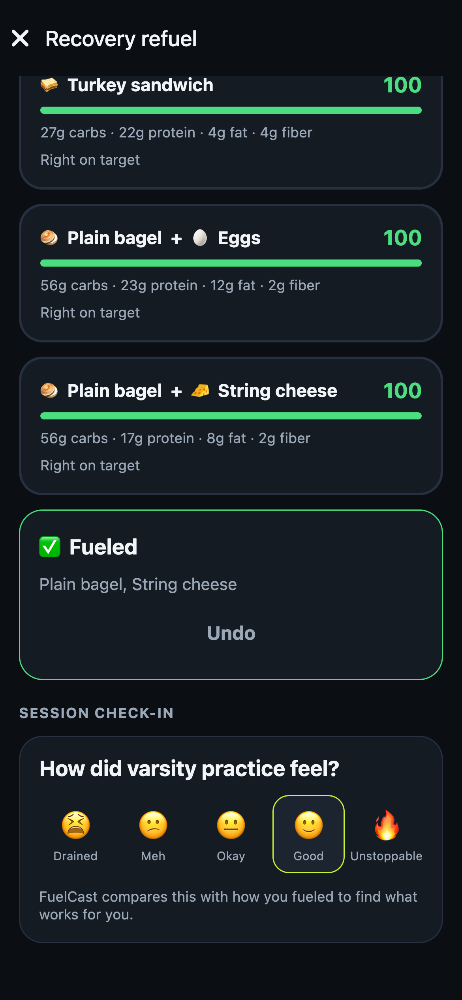 |
| **Welcome** | **Today: fuel forecast** | **Today: training + cook** | **Fuel window combos** |
|  | 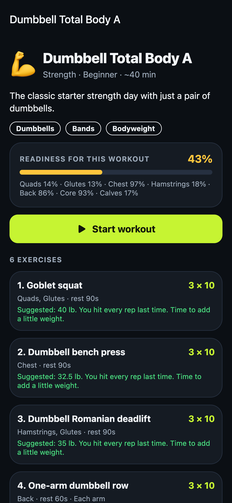 | 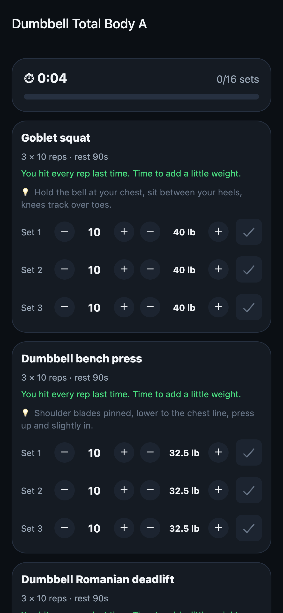 | 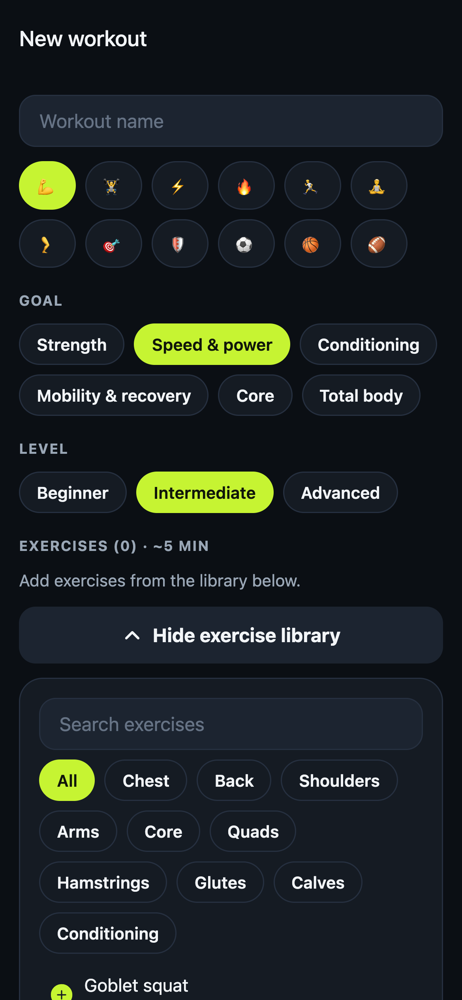 |
| **Smart Coach** | **Workout + readiness** | **Live workout logger** | **Custom workout builder** |
| 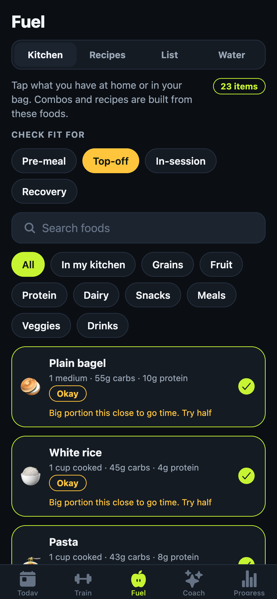 |  | 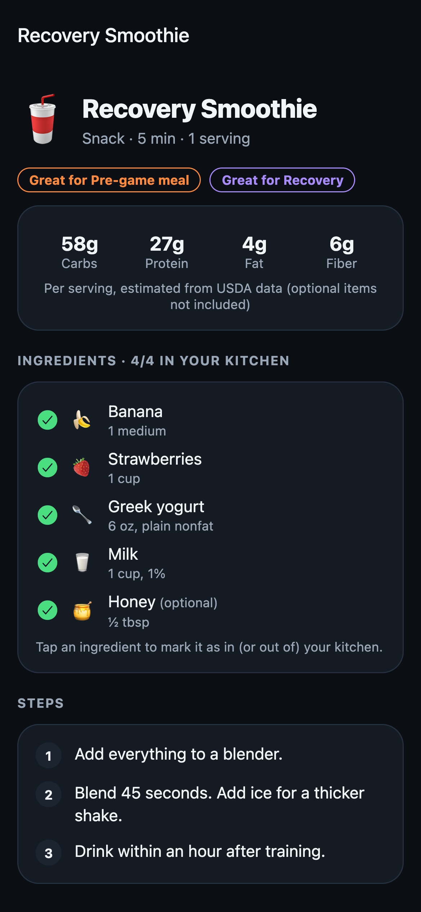 | 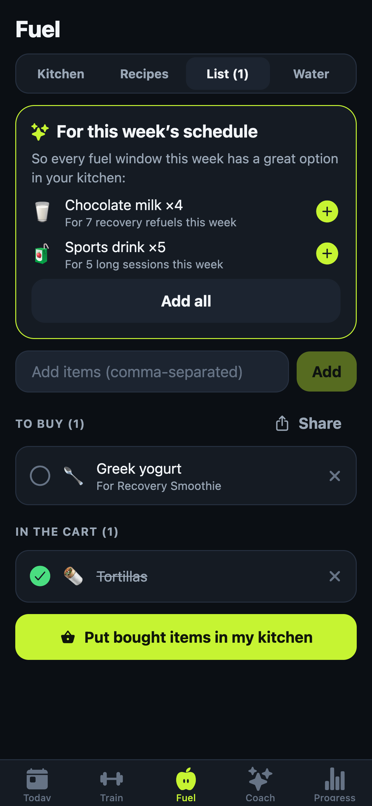 |
| **Kitchen + Fuel Fit** | **Recipes from your food** | **Recipe detail** | **Shopping list** |
|  |  | 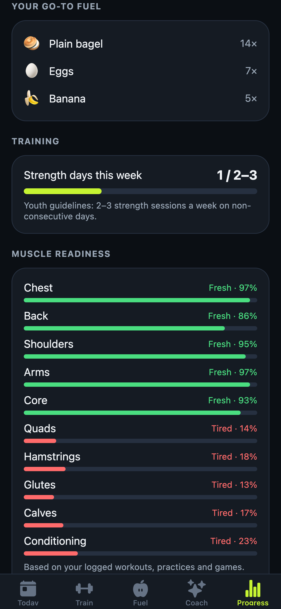 | 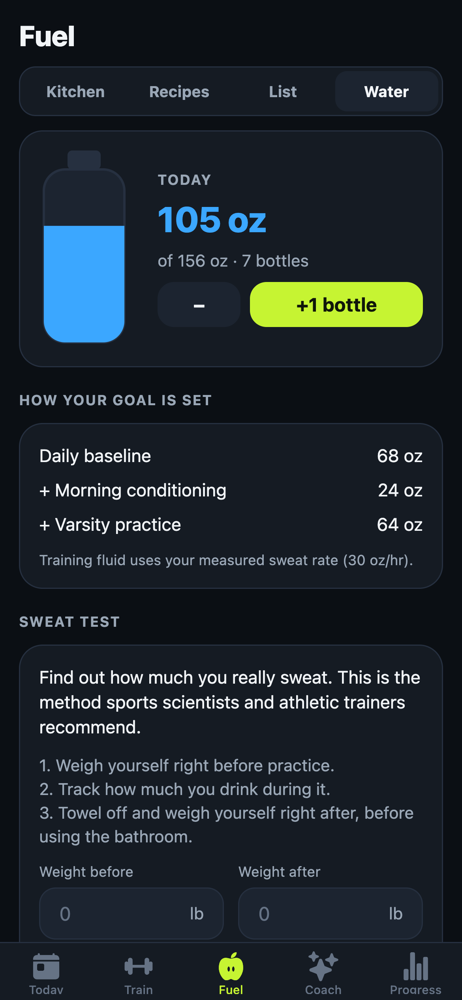 |
| **Coach chat** | **Progress** | **Muscle readiness** | **Hydration + sweat test** |

## Run it on your iPhone (5 minutes)

FuelCast is built with **Expo (React Native)**, so it runs on a real iPhone through the free **Expo Go** app. You don't need Xcode.

1. On the iPhone, install **Expo Go** from the App Store.
2. On the computer (Node.js 20+):
   ```bash
   cd fuelcast
   npm install
   npx expo start
   ```
3. Scan the QR code with the iPhone **Camera**. The phone and computer must be on the same Wi-Fi; on school Wi-Fi, use `npx expo start --tunnel`.
4. Tap **Explore with a sample athlete** for two weeks of demo data, or **Get started**.

**Optional: turn on the Claude AI Coach.** In **Settings → AI Coach**, paste an Anthropic API key from [console.anthropic.com](https://console.anthropic.com/settings/keys). Without a key, the Coach tab still answers the common requests on-device.

## How it works

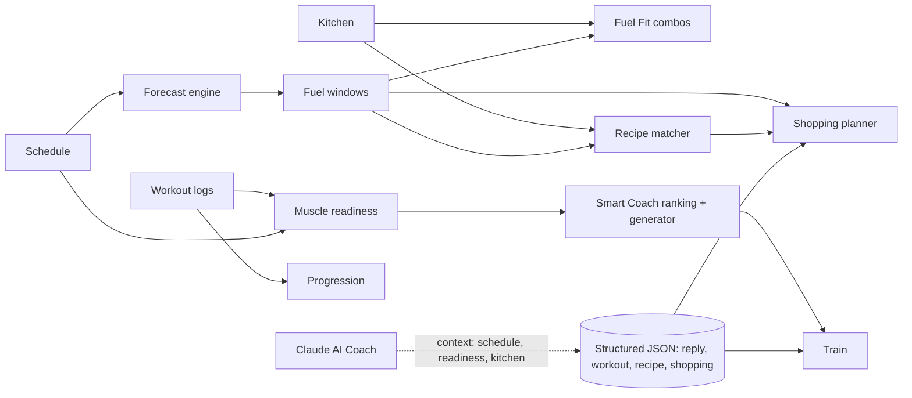

Every rule lives in a pure TypeScript **engine** (`src/engine/`), tested with Jest:

| Module | What it does |
|---|---|
| `forecast.ts` | Builds timed fuel windows; handles early sessions and two-a-days |
| `fuelFit.ts` | Rates foods per window; searches every 1–3 item combo; scores 0–100 |
| `coach.ts` | Muscle readiness (fatigue that halves every 24 h), day context, workout ranking with reasons, workout generator, weight progression |
| `recipes.ts` | Macros from ingredients, "great for" tags, ready/almost/shop matching |
| `shopping.ts` | Weekly staple suggestions, recipe gaps, de-duplication, food matching |
| `hydration.ts` | Sweat-rate test, itemized daily fluid goal |
| `insights.ts` | Fuel Score, streaks, fueled-vs-unfueled energy comparison |

The **AI Coach** (`src/ai/`) calls the Claude Messages API (`claude-opus-5`) with **structured outputs**. The JSON schema restricts workout exercises to IDs from our library, so every AI workout can be saved and run in the planner. Details: **[docs/ARCHITECTURE.md](docs/ARCHITECTURE.md)**.

## Tech stack

| Layer | Choice |
|---|---|
| App | Expo SDK 57 · React Native 0.86 · TypeScript (strict) · Expo Router |
| Storage | AsyncStorage (app data), iOS Keychain via expo-secure-store (API key) |
| AI | Claude API (`claude-opus-5`), structured JSON outputs, server-side refusal fallback |
| Graphics | react-native-svg |
| Quality | 67 Jest unit tests · GitHub Actions CI · `expo-doctor` 21/21 |

## Project structure

```
app/                     Screens (file = route)
  (tabs)/                Today · Train · Fuel · Coach · Progress
  window/[id].tsx        Fuel window: why, targets, combos, log
  workout/[id].tsx       Workout detail + readiness + suggested loads
  workout/edit.tsx       Custom workout builder
  workout/session.tsx    Live logger with rest timer
  recipe/[id].tsx        Recipe detail, shopping, log to a window
  event.tsx              Add/edit a session (link a workout)
  settings.tsx           Profile, training prefs, AI Coach key, data, sources
src/engine/              Pure logic (tested)
src/data/                Foods, exercises, starter workouts, recipes, demo athlete
src/ai/                  Claude client, context builder, offline coach, key storage
src/state/               Store (Context + AsyncStorage) and hooks
src/views/               Tab sections (Kitchen, Recipes, Shopping, Water, Schedule, Insights)
src/ui/                  Theme and shared components
__tests__/               Jest tests
docs/                    Architecture, research, design, video script, checklist
```

## Scripts

| Command | What it does |
|---|---|
| `npm start` | Start Expo (scan the QR with your iPhone) |
| `npm run web` | Run in a browser |
| `npm test` | Unit tests |
| `npm run typecheck` | TypeScript check |
| `npm run check` | Both (what CI runs) |

## Documentation

- [docs/ARCHITECTURE.md](docs/ARCHITECTURE.md): technical design, data flow, algorithms, AI integration
- [docs/RESEARCH.md](docs/RESEARCH.md): the problem, the audience, and the science with citations
- [docs/DESIGN.md](docs/DESIGN.md): UI/UX, screen flow, accessibility, ethics
- [docs/VIDEO_SCRIPT.md](docs/VIDEO_SCRIPT.md): the 3-minute pitch video script and shot list
- [docs/SUBMISSION_CHECKLIST.md](docs/SUBMISSION_CHECKLIST.md): competition requirements
- [CHANGELOG.md](CHANGELOG.md) · [CONTRIBUTING.md](CONTRIBUTING.md) · [LICENSE](LICENSE)

## Disclaimer

FuelCast is educational, not medical advice. Athletes with medical conditions, injuries, allergies or specific dietary needs should talk with their athletic trainer, doctor, or a registered dietitian. Macro values are rounded approximations based on USDA FoodData Central.

## License

[MIT](LICENSE)
