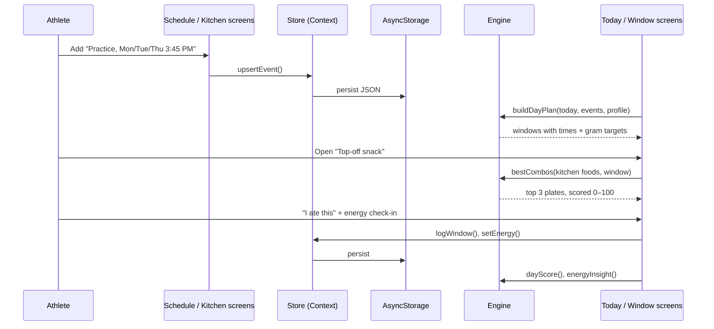

# FuelCast: Technical Architecture

This document explains how FuelCast works under the hood: the platform choice, how data flows, and the algorithms behind each feature.

## 1. Platform decision

| Option | Verdict |
|---|---|
| Native Swift / SwiftUI | Great for iOS but needs Xcode and a Mac build pipeline, and it runs only on Apple devices. |
| **Expo + React Native (chosen)** | Compiles to a **real native iOS app** (native views, not a web page). Development runs on a physical iPhone through **Expo Go**, with no Xcode needed. The same code also runs on Android and the web. |
| Web app / PWA | Easy, but not a real mobile app; no App Store path. |

FuelCast uses **Expo SDK 57** (React Native 0.86, React 19) with **TypeScript in strict mode**. When it's ready for the App Store, `eas build --platform ios` produces a signed `.ipa` from the same codebase.

## 2. Layered design

```
┌──────────────────────────────────────────────────────────────┐
│  UI layer: app/ (Expo Router screens), src/ui/ (components)   │
│  Reads state, calls actions, renders. No business rules.      │
├──────────────────────────────────────────────────────────────┤
│  State layer: src/state/store.tsx                             │
│  One React Context + AsyncStorage persistence.                │
│  useDay(date) → plan, events, goal, log, score (memoized)     │
├──────────────────────────────────────────────────────────────┤
│  Engine layer: src/engine/ (pure TypeScript, 0 dependencies)  │
│  forecast · fuelFit · targets · hydration · insights · time   │
│  Deterministic functions → easy to unit-test (Jest)           │
├──────────────────────────────────────────────────────────────┤
│  Data: src/data/foods.ts (USDA-based library), demo.ts        │
└──────────────────────────────────────────────────────────────┘
```

The engine has **no React or UI imports**. Every rule, from timing and scoring to hydration math, is a pure function that the Jest suite in `__tests__/` tests directly.

## 3. Data model

```ts
Profile        { name, sport, units, bottleMl, weightKg?, sweatRateLph? }
TrainingEvent  { id, title, kind, days[] | date, startMin, durationMin, intensity }
FuelWindow     { id, eventId, type, title, startMin, endMin, why, tip, targets, fluidMl? }
Targets        { carbs: {min,max}, protein: {min,max}, fatMax, fiberMax }   // grams
Food           { id, name, serving, category, carbs, protein, fat, fiber, fried?, caution? }
DayLog         { windows: {windowId → {status, foodIds, at}}, waterMl, energy: {eventId → 1..5} }
```

**Fuel windows are never stored.** They're computed from the schedule every time, so editing a practice time instantly updates the forecast. Only what the athlete *did* (logs) is saved. Times are "minutes after midnight" and days are local `YYYY-MM-DD` keys, which keeps the engine free of time-zone bugs.

## 4. Data flow



## 5. Algorithms

### 5.1 Forecast engine: `buildDayPlan()`

For each session on the day (start `s`, end `e`):

| Window | Timing | Rule |
|---|---|---|
| Pre-session meal | `s − 4h` → `s − 3h` | Only if it starts at or after 6:00 AM. If it falls between 11:00 and 1:30, the tip says "this is your school lunch." |
| Light breakfast | `s − 2h` → `s − 1.5h` | Replaces the meal for early sessions (on or after 7:30 AM start) |
| Top-off snack | `s − 60` → `s − 30` min | Always; for very early sessions it moves to `s − 45` → `s − 15` |
| In-session fuel | `s` → `e` | Only if ≥ 75 min, or hard and ≥ 60 min |
| Recovery | `e` → `e + 60` min | Always |

Then three **collision rules** run for multi-session days:
1. Drop any pre-session window that lands inside a *different* session.
2. If two sessions' pre-fuel windows overlap, the sooner session's window wins.
3. If a recovery window overlaps the next session's pre-fuel (or the next session starts inside it), the pre-fuel is dropped and the recovery becomes **"Recover + reload."**

### 5.2 Gram targets: `windowTargets()`

Based on the ACSM/AND/DC joint position statement (see RESEARCH.md). When the athlete gives a weight, targets scale with it; otherwise standard teen defaults are used.

| Window | Carbs | Protein | Fat max | Fiber max |
|---|---|---|---|---|
| Pre-meal | 1–2 g/kg (default 60–100 g) | 15–35 g | 20 g | 10 g |
| Light breakfast | 30–60 g | 5–20 g | 10 g | 6 g |
| Top-off | 15–30 g | ≤ 10 g | 5 g | 4 g |
| In-session | 30–60 g per hour | ≤ 5 g | 3 g | 3 g |
| Recovery | 0.5–1.0 g/kg (default 30–60 g) | ~0.25 g/kg (default 15–25 g) | 20 g | 12 g |

### 5.3 Fuel Fit: `itemFit()` and `bestCombos()`

**Step 1: rate each food for the window.** Each food gets *Great / Okay / Not now* with a plain-English reason, based on digestion science. For example, before training, fried or high-fat (> 7 g), high-fiber (> 5 g), or protein-heavy (> 15 g) foods are "Not now," and a large carb portion (> 40 g) is "Okay: try half." Energy drinks are always "Not now" (AAP guidance).

**Step 2: search every combination.** From the foods in the athlete's kitchen that aren't "Not now," FuelCast enumerates every plate of 1, 2, or 3 items (a kitchen of 18 foods gives at most 987 plates, which takes milliseconds on a phone).

**Step 3: score each plate (0–100) against the targets.**

```
score = 100
  − 40 × (carb shortfall ÷ carb min)          // fuel is the point
  − 20 × (carb excess ÷ carb max, capped at 1)
  − 30 × (protein shortfall ÷ protein min)
  − 10 × (protein excess ÷ protein max, capped at 1)
  − min(25, 2 × grams of fat over the limit)  // slows digestion
  − min(20, 3 × grams of fiber over the limit) // GI distress
```
Ranges have a 5% tolerance so being "1 g short" isn't treated as a miss. Each deduction also produces a note, such as "Add ~12 g protein."

**Step 4: pick varied results.** Plates are sorted by score (ties go to fewer items). A plate is skipped if it's just a superset or subset of one already picked, so the top 3 give real choices.

### 5.4 Hydration: `sweatTest()` and `goalBreakdown()`

```
sweat rate (L/h) = (weight before − weight after + fluid drunk − urine) ÷ hours
% body mass lost = (weight before − weight after) ÷ weight before × 100   (warn at ≥ 2%)
replace after    = 1.25–1.5 L per kg lost
drink during     ≈ 80% of sweat rate per hour
```
Inputs are validated: no blanks, sessions of 15–300 minutes, and a weight change of at most 6% (anything bigger is almost certainly a typo).

Daily goal = **2.0 L baseline** + for each session: `hours × sweat rate (or 0.5 L/h default) × intensity factor (light 0.7, moderate 1.0, hard 1.2)`, rounded to 50 mL and shown as an itemized list.

### 5.5 Insights: `dayScore()`, `energyInsight()`, `streak()`

- **Fuel Score** = 80 × (windows completed ÷ windows planned) + 20 × (water ÷ goal). Rest days are scored on hydration only.
- **Fuel vs. energy**: each session with an energy rating is labeled *fueled* if the athlete completed a pre-meal or top-off for it (or a "Recover + reload" feeding into it). FuelCast averages the ratings in each group, and only shows the comparison once both groups have at least 2 sessions.
- **Streak** = consecutive days with Fuel Score ≥ 70. Today only counts once it reaches 70, so an unfinished day doesn't break the streak.

## 6. Persistence and privacy

- The whole app state is one JSON document saved to **AsyncStorage** (iOS: app-sandboxed native storage; web: localStorage) after every change.
- The saved state is version-checked on load. Corrupt or incompatible data falls back to a clean start instead of crashing.
- Screens don't render until saved data has loaded, so there's no flash of default values.
- **Nothing leaves the device**: no accounts, no analytics, no network calls.

## 7. Quality

| Check | How |
|---|---|
| Type safety | `tsc --noEmit` in strict mode, no `any` |
| Logic | Jest unit tests for forecast timing, collision rules, scoring, combo search, sweat math, insights, date math |
| Native build | `npx expo export --platform ios` compiles the iOS bundle |
| Dependency health | `npx expo-doctor`: 21/21 checks pass |
| CI | GitHub Actions runs type-check and tests on every push and pull request |

## 8. Roadmap

1. **Push reminders** ("Top-off snack in 10 minutes") with `expo-notifications`
2. **Team mode**: coaches share the schedule with a code, so athletes don't enter it themselves
3. **School-menu import**: pull the cafeteria menu so lunch picks are specific
4. **Apple Health**: import workouts automatically
5. **Allergy and dietary filters** (vegetarian, dairy-free, nut-free) in the combo search
