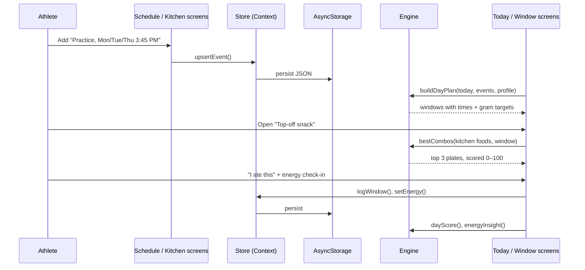
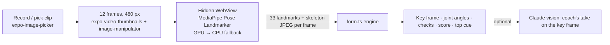

# FuelCast: Technical Architecture

This document explains how FuelCast works under the hood: the platform choice, how data flows, and the algorithms behind each feature.

## 1. Platform decision

| Option | Verdict |
|---|---|
| Native Swift / SwiftUI | Great for iOS but needs Xcode and a Mac build pipeline, and it runs only on Apple devices. |
| **Expo + React Native (chosen)** | Compiles to a **real native iOS app** (native views, not a web page). Development runs on a physical iPhone through **Expo Go**, with no Xcode needed. The same code also runs on Android and the web. |
| Web app / PWA | Easy, but not a real mobile app; no App Store path. |

FuelCast uses **Expo SDK 57** (React Native 0.86, React 19) with **TypeScript in strict mode**. When it's ready for the App Store, `eas build --platform ios` produces a signed `.ipa` from the same codebase.

## 2. Layered design

```
┌──────────────────────────────────────────────────────────────┐
│  UI layer: app/ (Expo Router screens), src/ui/ (components)   │
│  Reads state, calls actions, renders. No business rules.      │
├──────────────────────────────────────────────────────────────┤
│  State layer: src/state/store.tsx                             │
│  One React Context + AsyncStorage persistence.                │
│  useDay(date) → plan, events, goal, log, score (memoized)     │
├──────────────────────────────────────────────────────────────┤
│  Engine layer: src/engine/ (pure TypeScript, 0 dependencies)  │
│  forecast · fuelFit · targets · hydration · insights · time   │
│  coach (readiness, ranking, generator, progression)           │
│  recipes · shopping · form (pose → joint angles → grade)      │
│  Deterministic functions → easy to unit-test (Jest)           │
├──────────────────────────────────────────────────────────────┤
│  AI layer: src/ai/ (Claude client, context, offline coach,    │
│  Keychain key storage)                                        │
│  Vision layer: src/form/ (MediaPipe pose in WebView/iframe,   │
│  frame extraction)                                            │
├──────────────────────────────────────────────────────────────┤
│  Data: foods (59), exercises (56), starter workouts (20),     │
│  recipes (20), demo athlete                                   │
└──────────────────────────────────────────────────────────────┘
```

The engine has **no React or UI imports**. Every rule, from timing and scoring to hydration math, is a pure function that the Jest suite in `__tests__/` tests directly.

## 3. Data model

```ts
Profile        { name, sport, units, bottleMl, weightKg?, sweatRateLph? }
TrainingEvent  { id, title, kind, days[] | date, startMin, durationMin, intensity }
FuelWindow     { id, eventId, type, title, startMin, endMin, why, tip, targets, fluidMl? }
Targets        { carbs: {min,max}, protein: {min,max}, fatMax, fiberMax }   // grams
Food           { id, name, serving, category, carbs, protein, fat, fiber, fried?, caution? }
DayLog         { windows: {windowId → {status, foodIds, at}}, waterMl, energy: {eventId → 1..5} }
Exercise       { id, name, muscles[], secondary[], equipment, type, cue, timed? }
Workout        { id, name, goal, level, durationMin, items: [{exerciseId, sets, reps, restSec}], custom?, source? }
WorkoutLog     { id, workoutId, date, startedAt, finishedAt, rpe?, sets: [{exerciseId, targetReps, reps, weightKg?, done}] }
Recipe         { id, name, meal, minutes, ingredients: [{foodId, servings, optional?}], steps[] }
ShoppingItem   { id, name, foodId?, note?, checked, source }
ChatMessage    { role, text, content? (raw API blocks), workout?, recipe?, shopping?, offline? }
```

Saved data is **versioned** (currently v2). Version-1 data from FuelCast 1.0 is migrated automatically on first launch, so existing users keep their history.

**Fuel windows are never stored.** They're computed from the schedule every time, so editing a practice time instantly updates the forecast. Only what the athlete *did* (logs) is saved. Times are "minutes after midnight" and days are local `YYYY-MM-DD` keys, which keeps the engine free of time-zone bugs.

## 4. Data flow



## 5. Algorithms

### 5.1 Forecast engine: `buildDayPlan()`

For each session on the day (start `s`, end `e`):

| Window | Timing | Rule |
|---|---|---|
| Pre-session meal | `s − 4h` → `s − 3h` | Only if it starts at or after 6:00 AM. If it falls between 11:00 and 1:30, the tip says "this is your school lunch." |
| Light breakfast | `s − 2h` → `s − 1.5h` | Replaces the meal for early sessions (on or after 7:30 AM start) |
| Top-off snack | `s − 60` → `s − 30` min | Always; for very early sessions it moves to `s − 45` → `s − 15` |
| In-session fuel | `s` → `e` | Only if ≥ 75 min, or hard and ≥ 60 min |
| Recovery | `e` → `e + 60` min | Always |

Then three **collision rules** run for multi-session days:
1. Drop any pre-session window that lands inside a *different* session.
2. If two sessions' pre-fuel windows overlap, the sooner session's window wins.
3. If a recovery window overlaps the next session's pre-fuel (or the next session starts inside it), the pre-fuel is dropped and the recovery becomes **"Recover + reload."**

### 5.2 Gram targets: `windowTargets()`

Based on the ACSM/AND/DC joint position statement (see RESEARCH.md). When the athlete gives a weight, targets scale with it; otherwise standard teen defaults are used.

| Window | Carbs | Protein | Fat max | Fiber max |
|---|---|---|---|---|
| Pre-meal | 1–2 g/kg (default 60–100 g) | 15–35 g | 20 g | 10 g |
| Light breakfast | 30–60 g | 5–20 g | 10 g | 6 g |
| Top-off | 15–30 g | ≤ 10 g | 5 g | 4 g |
| In-session | 30–60 g per hour | ≤ 5 g | 3 g | 3 g |
| Recovery | 0.5–1.0 g/kg (default 30–60 g) | ~0.25 g/kg (default 15–25 g) | 20 g | 12 g |

### 5.3 Fuel Fit: `itemFit()` and `bestCombos()`

**Step 1: rate each food for the window.** Each food gets *Great / Okay / Not now* with a plain-English reason, based on digestion science. For example, before training, fried or high-fat (> 7 g), high-fiber (> 5 g), or protein-heavy (> 15 g) foods are "Not now," and a large carb portion (> 40 g) is "Okay: try half." Energy drinks are always "Not now" (AAP guidance).

**Step 2: search every combination.** From the foods in the athlete's kitchen that aren't "Not now," FuelCast enumerates every plate of 1, 2, or 3 items (a kitchen of 18 foods gives at most 987 plates, which takes milliseconds on a phone).

**Step 3: score each plate (0–100) against the targets.**

```
score = 100
  − 40 × (carb shortfall ÷ carb min)          // fuel is the point
  − 20 × (carb excess ÷ carb max, capped at 1)
  − 30 × (protein shortfall ÷ protein min)
  − 10 × (protein excess ÷ protein max, capped at 1)
  − min(25, 2 × grams of fat over the limit)  // slows digestion
  − min(20, 3 × grams of fiber over the limit) // GI distress
```
Ranges have a 5% tolerance so being "1 g short" isn't treated as a miss. Each deduction also produces a note, such as "Add ~12 g protein."

**Step 4: pick varied results.** Plates are sorted by score (ties go to fewer items). A plate is skipped if it's just a superset or subset of one already picked, so the top 3 give real choices.

### 5.4 Hydration: `sweatTest()` and `goalBreakdown()`

```
sweat rate (L/h) = (weight before − weight after + fluid drunk − urine) ÷ hours
% body mass lost = (weight before − weight after) ÷ weight before × 100   (warn at ≥ 2%)
replace after    = 1.25–1.5 L per kg lost
drink during     ≈ 80% of sweat rate per hour
```
Inputs are validated: no blanks, sessions of 15–300 minutes, and a weight change of at most 6% (anything bigger is almost certainly a typo).

Daily goal = **2.0 L baseline** + for each session: `hours × sweat rate (or 0.5 L/h default) × intensity factor (light 0.7, moderate 1.0, hard 1.2)`, rounded to 50 mL and shown as an itemized list.

### 5.5 Insights: `dayScore()`, `energyInsight()`, `streak()`

- **Fuel Score** = 80 × (windows completed ÷ windows planned) + 20 × (water ÷ goal). Rest days are scored on hydration only.
- **Fuel vs. energy**: each session with an energy rating is labeled *fueled* if the athlete completed a pre-meal or top-off for it (or a "Recover + reload" feeding into it). FuelCast averages the ratings in each group, and only shows the comparison once both groups have at least 2 sessions.
- **Streak** = consecutive days with Fuel Score ≥ 70. Today only counts once it reaches 70, so an unfinished day doesn't break the streak.

### 5.6 Smart Coach: `readiness()`, `recommend()`

**Muscle readiness.** Every completed set adds fatigue to the muscles it works (1.0 for primary muscles, 0.5 for secondary), scaled by the session's effort (RPE ÷ 7). Every practice or game adds fatigue to the legs and conditioning (1.5 / 2 / 3 "set equivalents" per hour for light, moderate and hard). Fatigue **halves every 24 hours**, and readiness = 1 − fatigue ÷ 10 (clamped 0–1).

**Day context** decides the mode, checked in this order:

| Condition | Mode | What it favors |
|---|---|---|
| Already trained today | Done | Mobility only |
| Game today | Game-day prime | Mobility ≤ 20 min |
| Game tomorrow | Keep it light | Mobility, core, upper body; no loaded leg work, conditioning or power |
| Game yesterday, or legs < 35% ready | Recover | Mobility |
| Strength yesterday, or ≥ 3 strength days this week | Alternate | Conditioning, core, mobility |
| Otherwise | Train | Your goal |

**Ranking.** Each workout the athlete has the equipment for (and that's at most one level above theirs) scores `40 + 40 × readiness of the muscles it hits`, +15 for matching the goal, −30 if one level up, a fit-to-time bonus or penalty, −30/−10 if done in the last 1/3 days, plus the mode's modifiers. The top 3 come back with plain-English reasons ("Won't tire your legs before the game", "Targets fresh muscles").

### 5.7 Workout generator: `generateWorkout()`

Each focus (total body, upper, lower, power, core, conditioning, mobility) is a list of **movement slots** (squat, hinge, single-leg, push, pull, core, jump…). For each slot, it picks from candidate exercises the athlete can do (equipment; barbells only for intermediate+), preferring the freshest muscles and rotating between near-equal choices. The dose follows the athlete's level (beginner 2×12, intermediate 3×10, advanced 3×8; power 3×4–5). Then it fits the time budget: trim sets from the end, drop exercises (keeping at least 3), and add sets back if there's lots of time left.

### 5.8 Progression: `suggestLoad()`

It looks up the last session with weight for that exercise. If every set hit its target reps and effort was ≤ 8/10, it suggests about 5% more, rounded up to the next plate step (2.5 lb or 1 kg, and at least one step). Otherwise it suggests repeating the weight ("Own this weight first"). The live logger pre-fills these weights.

### 5.9 Recipes and shopping

- **Recipe macros** are computed from ingredient quantities × the same USDA-based food values, so they're always consistent with the rest of the app.
- **"Great for" tags:** a recipe is tagged for a window only if it scores ≥ 85 with the Fuel Fit scorer **and** meets that window's core needs (pre-game: ≥ 90% of carb target, fat and fiber under limits; recovery: carbs and protein both ≥ 90% of target; top-off: small and easy to digest).
- **Matching:** ready (have every required ingredient), almost (missing 1–2), or shop. Ranked by status, then by fit for the chosen window.
- **Week plan:** it counts each window type across the next 7 days. If the kitchen has fewer than two "great fit" foods for a window type, it suggests staples that *are* great fits, with quantities ("Banana ×7: for 7 top-off snacks this week").
- **Bought items** that match a library food move into the kitchen with one tap.

### 5.10 AI Coach (Claude)

| Piece | Design |
|---|---|
| Model | `claude-opus-5` via the Messages API, `effort: low` for fast chat replies |
| Transport | `fetch` to `https://api.anthropic.com/v1/messages`. The official TypeScript SDK documents that React Native is not a supported runtime, so the app sends the same request shape over REST. |
| Output | **Structured outputs** (`output_config.format` with a JSON schema): `{ reply, workout \| null, recipe \| null, shopping[] }`. The schema's `exerciseId` is an **enum of our 56 exercise IDs**, so an AI workout always maps to real exercises and can be saved and run in the planner. |
| Context | Each message is prefixed with an `<athlete_context>` block: sport, level, goal, equipment, the next 4 days of schedule, the next fuel window, muscle readiness, the last 5 workouts, and kitchen foods. **No name or body weight.** |
| Safety | The system prompt encodes youth training and fueling guidance, bans calorie, weight-loss and supplement advice, and routes pain, injury or disordered-eating mentions to an athletic trainer or doctor. `stop_reason: "refusal"` is handled, and the server-side `fallbacks: "default"` option is enabled. |
| Efficiency | The long, stable system prompt (including the exercise list) is marked `cache_control: ephemeral` for prompt caching. Only completed exchanges are replayed as history, with the assistant's content blocks sent back unchanged. |
| Reliability | 90 s timeout, one retry on 408/409/429/5xx/529 or network failure, and friendly messages for bad keys, billing, rate limits and outages. The response's numbers are clamped (sets 1–6, reps 1–30 or 1–600 s, rest 0–300 s), and unknown exercises are dropped. |
| Key | Entered by the athlete in Settings and stored in the iOS **Keychain** (`expo-secure-store`); never in the app-state JSON. |
| Offline | Without a key, the Coach tab answers the four common intents on-device with the engines above: plan today, build a workout, cook from the kitchen, plan shopping. |

### 5.11 AI Form Check



| Piece | Design |
|---|---|
| Pose model | Google **MediaPipe Pose Landmarker (full)** in WebAssembly, loaded from jsDelivr and Google's model bucket the first time, then cached. It runs **on the phone**; no video is uploaded. |
| Why a WebView | Expo Go can't load custom native ML modules. A hidden `react-native-webview` runs the same MediaPipe web build that works in Safari, so the app runs on a real iPhone without Xcode. On the web build, the same page runs in an iframe. |
| Frames | Native: 12 evenly spaced thumbnails from the first 10 s (`expo-video-thumbnails`), resized to 480 px JPEG. Web: the page samples the `<video>` itself. Photos work too. |
| Protocol | JSON messages (`frame` / `video` → `frame` … `done` / `error`), with a 30 s per-frame timeout and a 60 s model-load timeout, and friendly errors. |
| Key frame | Squat: smallest knee angle. Push-up: smallest elbow angle. Hinge: most torso lean. Lunge: lowest hips. Landing: lowest hips relative to ankles. Plank: the median body-line frame (robust to one odd frame). |
| Measurements | Pixel-space angles (normalized landmarks × image size, so there's no aspect distortion). The camera side with the more visible joints is used. Joints below 50% visibility aren't graded, and the app says what it couldn't see. |
| Rules | Squat: depth (knee ≤ 100° or hip at or below knee) and chest lean (≤ 45°). Push-up: body line (shoulder–hip–ankle ≥ 165°, sag vs. pike) and elbow depth (≤ 100°). Hinge: torso lean ≥ 45° and knees 135–175°. Lunge: front knee 75–110° and torso ≤ 20°. Plank: body line ≥ 165° and elbows under shoulders. Jump landing (front view): **knee-to-ankle separation ratio** ≥ 0.8 (below it, the knees cave in) and hip drop ≥ 15% (a soft landing; videos only). |
| Camera-angle check | Shoulder and hip width ÷ torso length, calibrated on real photos (side ≈ 0.15, front/back ≈ 0.40). If a side-view movement is filmed head-on (or the reverse), the result says so and treats the grade as rough. |
| Score | good = 100, needs work = 60, fix = 20, averaged; plus a verdict and the single most useful cue. |
| Claude (optional) | Sends one annotated key frame (JPEG, about 25 KB) plus the measurements to `claude-opus-5` as an image block, which returns 2–4 short cues. Requires the athlete's key. |

**Validation:** 15 unit tests use synthetic poses with known angles (good and bad squats, a sagging push-up, a hinge vs. a "squatty" hinge, a piked plank, a valgus landing, stiff vs. soft landings, the camera-angle check, and missing joints). The full pipeline was also run in a browser on real public-domain footage from Wikimedia Commons: a side-view squat photo (graded "almost parallel", 101°) and a back-view squat video (12 frames, bottom found at 2.1 s, correctly flagged as the wrong camera angle).

> **Production note:** a store release would route AI requests through a small backend (so no API key lives on the phone) and add per-user rate limits. The client code already isolates the call in `askCoach()`, so swapping the endpoint is a one-line change.

## 6. Persistence and privacy

- The whole app state is one JSON document saved to **AsyncStorage** (iOS: app-sandboxed native storage; web: localStorage) after every change.
- The saved state is version-checked on load. Corrupt or incompatible data falls back to a clean start instead of crashing.
- Screens don't render until saved data has loaded, so there's no flash of default values.
- **Nothing leaves the device** except optional AI Coach messages (to api.anthropic.com), which the athlete turns on with their own key. Form Check videos are analyzed on the phone; only the pose library and model are downloaded (once). No accounts, no analytics.

## 7. Quality

| Check | How |
|---|---|
| Type safety | `tsc --noEmit` in strict mode, no `any` |
| Logic | 85 Jest unit tests: forecast timing and collisions, Fuel Fit scoring and combo search, sweat math, insights, readiness, coach modes, workout generator, progression, recipe tags and matching, shopping suggestions, AI request/response handling (with a mocked network), form-check geometry and rules, getting-started checklist, saved-data migration |
| Native build | `npx expo export --platform ios` compiles the iOS bundle |
| Dependency health | `npx expo-doctor`: 21/21 checks pass |
| CI | GitHub Actions runs type-check and tests on every push and pull request |

## 8. Roadmap

1. **Live form feedback**: real-time pose tracking from the camera with rep counting (needs a native camera module in a custom build)
2. **Push reminders** ("Top-off snack in 10 minutes") with `expo-notifications`
3. **Coach backend**: a small server so the AI Coach works without a personal API key
4. **Team mode**: coaches share the schedule and assign workouts with a code
5. **School-menu import**: pull the cafeteria menu so lunch picks are specific
6. **Apple Health**: import workouts and heart-rate data automatically
7. **Allergy and dietary filters** (vegetarian, dairy-free, nut-free) in combos, recipes and the shopping list
