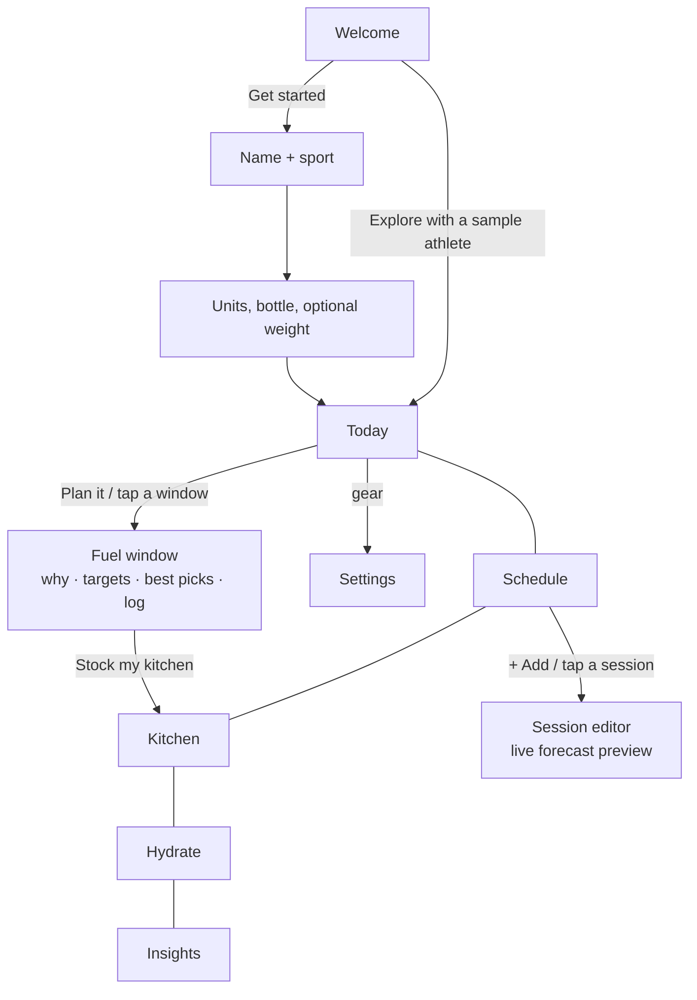

# FuelCast: UI/UX Design

## Design goals

1. **Answer "what do I do right now?" in under 3 seconds.** The top card on Today is always the current or next fuel window, with a countdown and one button.
2. **Teach without lecturing.** Every window has a one-sentence "Why it matters" and a practical tip. No jargon walls.
3. **Performance framing, never body framing.** The app talks about fuel, energy, and recovery, never calories or weight loss.
4. **Fast logging.** Logging a window takes two taps (pick a combo, then "I ate this"). An energy check-in takes one tap.

## Visual language

| Token | Value | Used for |
|---|---|---|
| Background | `#0B0F14` | Dark, sporty, easy on the eyes in a locker room |
| Accent | `#C6F432` electric lime | Primary actions, Fuel Score, selected state |
| Pre-meal | `#FF8A3D` orange | The meal window |
| Top-off | `#FFC53D` yellow | The quick snack (lightning icon) |
| In-session | `#3BA7FF` blue | Fuel and water during training |
| Recovery | `#A78BFA` violet | The recovery window |
| Great / Okay / Not now | green / yellow / red | Fuel Fit ratings (always shown **with a text label**, never color alone) |

Each window type has a consistent **color and icon** across the timeline, the detail screen, the session preview, and the Insights bars, so athletes learn the system at a glance.

Typography uses the system font (SF Pro on iPhone) with a clear scale: 30 / 24 / 18 / 15 / 12 pt.

## Screen flow

## Key screens

| Screen | Purpose | Details that matter |
|---|---|---|
| **Welcome / onboarding** | Value in 4 lines, then a 2-step setup | "Explore with a sample athlete" lets judges and new users see a full app instantly. Weight is explicitly optional, with the reason given. |
| **Today** | The fuel forecast | Fuel Score ring; "Right now / Up next" card with a countdown; a vertical timeline with colored dots (filled = done); past-but-missed windows are dimmed, and the hero card invites you to log them; one-tap water. |
| **Fuel window** | Turn advice into a decision | Why, gram targets as pills, the top 3 combos from *your* kitchen with a 0–100 score and a plain-English note, and a fallback to popular picks if the kitchen is empty. |
| **Schedule / session editor** | Enter your week once | Chips instead of typing; steppers in 15-minute steps; a **live preview** of the windows the session will create. |
| **Kitchen** | What you have = what you're offered | "Check fit for" switches every food's rating between window types, with a reason for each rating. |
| **Hydrate** | Personalized fluids | An animated bottle, an itemized goal ("why is my goal 156 oz?"), and a 3-step sweat test with validation and a warning at 2% loss. |
| **Insights** | Close the habit loop | Streak, 7-day Fuel Score bars, fuel vs. energy comparison, per-window hit rates with the "biggest opportunity," and your go-to foods. |

## Accessibility

- Buttons, chips, and checkboxes set `accessibilityRole` and state, so VoiceOver reads them as controls with their selected or checked state.
- Ratings always have **text + color**, never color alone.
- Tap targets are at least 44 pt (steppers, tab bar, and list rows).
- High-contrast text on the dark background.
- Destructive actions (delete a session, reset data) need a **second tap to confirm**.

## Empty and error states

- No sessions yet → the Today hero says "Let's build your forecast" and shows an **Add a session** card.
- Rest day → "Recover and refill" plus tomorrow's first session.
- Empty kitchen → popular picks from the full library plus a **Stock my kitchen** button.
- Invalid sweat-test numbers → a specific, friendly error (for example, "That's a bigger change than a single session causes. Re-weigh and try again.").
- Insights before enough data → explains exactly what's needed ("rate how your sessions feel…").
