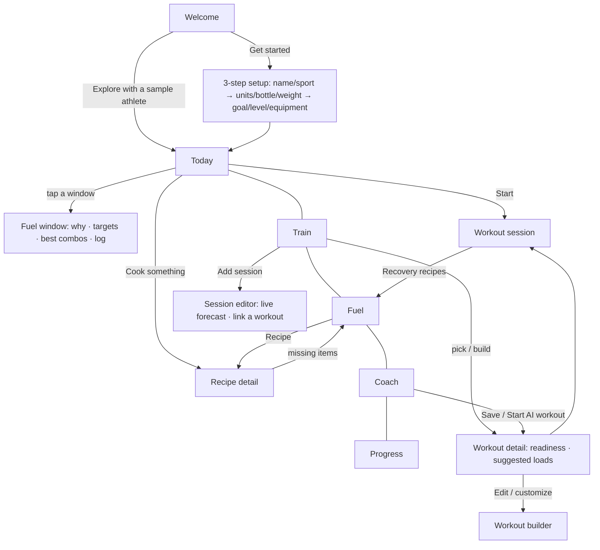

# FuelCast: UI/UX Design

## Design goals

1. **Answer "what do I do right now?" in under 3 seconds.** The top card on Today is always the current or next fuel window, with a countdown and one button.
2. **Teach without lecturing.** Every window has a one-sentence "Why it matters" and a practical tip. No jargon walls.
3. **Performance framing, never body framing.** The app talks about fuel, energy, and recovery, never calories or weight loss.
4. **Fast logging.** Logging a window takes two taps (pick a combo, then "I ate this"), an energy check-in takes one, and a set takes one.
5. **Explain every recommendation.** Every score, pick and tag comes with a short reason, so athletes learn *why*, not just *what*.

## Visual language

| Token | Value | Used for |
|---|---|---|
| Background | `#0B0F14` | Dark, sporty, easy on the eyes in a locker room |
| Accent | `#C6F432` electric lime | Primary actions, Fuel Score, selected state |
| Pre-meal | `#FF8A3D` orange | The meal window |
| Top-off | `#FFC53D` yellow | The quick snack (lightning icon) |
| In-session | `#3BA7FF` blue | Fuel and water during training |
| Recovery | `#A78BFA` violet | The recovery window |
| Great / Okay / Not now | green / yellow / red | Fuel Fit ratings (always shown **with a text label**, never color alone) |

Each window type has a consistent **color and icon** across the timeline, the detail screen, the session preview, and the Insights bars, so athletes learn the system at a glance.

Typography uses the system font (SF Pro on iPhone) with a clear scale: 30 / 24 / 18 / 15 / 12 pt.

## Information architecture: five tabs

| Tab | Question it answers | Sections |
|---|---|---|
| **Today** | "What do I do right now?" | Fuel Score, next fuel window, fuel forecast timeline, today's training, a recipe you can cook, water |
| **Train** | "How should I train?" | Plan (Smart Coach picks, one-tap workout builder, weekly schedule) · Workouts (library and custom) · History |
| **Fuel** | "What do I eat, cook and buy?" | Kitchen (Fuel Fit ratings) · Recipes · List (shopping) · Water (hydration and sweat test) |
| **Coach** | "Can I just ask?" | Chat with the AI Coach (Claude), or on-device Smart Coach answers offline |
| **Progress** | "Is it working?" | Fuel Score trend, streak, fuel vs. energy, windows hit, strength days, muscle readiness |

## Screen flow

## Key screens

| Screen | Details that matter |
|---|---|
| **Today** | One glance: score ring, "Right now / Up next" countdown, a timeline with colored dots (filled = done), then **training** (scheduled workout or Smart Coach pick) and **cook something** (the best recipe you can make now). |
| **Fuel window** | Why it matters, gram targets as pills, the top 3 combos from *your* kitchen with 0–100 scores and notes, and one tap to log. |
| **Smart Coach card** | A headline mode ("Game tomorrow: keep it light"), a plain-English reason, a one-tap Start, and 3 ranked workouts, each with ✓ reasons. Explainable AI, not a black box. |
| **Workout detail** | A readiness % for the muscles it hits, sets × reps, rest, suggested weight with why, and tap-to-reveal coaching cues. |
| **Workout session** | Big +/− steppers for reps and weight, a checkbox per set, an automatic rest timer, effort (1–10) at the end, then a "refuel within the hour" nudge that links to recovery recipes. |
| **Workout builder** | Search or filter the 56-exercise library by muscle; per-exercise sets, reps and rest steppers; reorder and remove; a live time estimate. |
| **Recipes** | A "What food do you have?" box (type "eggs, tortillas, cheese"), then Ready / Almost / Shop sections with window tags and missing items. |
| **Shopping list** | Suggestions from this week's schedule with counts and reasons, typed items, check-off, share, and "Put bought items in my kitchen". |
| **Coach** | Chat bubbles labeled "AI Coach · Claude" or "Smart Coach · on-device"; replies can carry a workout card (Save / Start), a recipe card and shopping chips (Add to list). There are quick-prompt chips and a clear "Offline mode" badge. |
| **Settings** | Profile, training preferences, the AI Coach key with a plain explanation of exactly what's sent, demo data, reset, and cited sources. |

## Accessibility

- Buttons, chips, and checkboxes set `accessibilityRole` and state, so VoiceOver reads them as controls with their selected or checked state.
- Ratings always have **text + color**, never color alone.
- Main steppers, the tab bar and list rows are at least 44 pt; the compact steppers in the workout logger get extra touch area (hitSlop).
- High-contrast text on the dark background.
- Destructive actions (delete a session or workout, discard a workout, clear chat, reset data) need a **second tap to confirm**.

## Empty and error states

- No sessions yet → the Today hero says "Let's build your forecast" and shows an **Add a session** card.
- Rest day → "Recover and refill" plus tomorrow's first session.
- Empty kitchen → popular picks from the full library plus a **Stock my kitchen** button.
- Invalid sweat-test numbers → a specific, friendly error (for example, "That's a bigger change than a single session causes. Re-weigh and try again.").
- Insights before enough data → explains exactly what's needed ("rate how your sessions feel…").
- No API key → Coach runs in offline mode and says so, with a Connect button.
- AI errors (bad key, rate limit, no internet, refusal) → a friendly message in the chat, never a crash.
